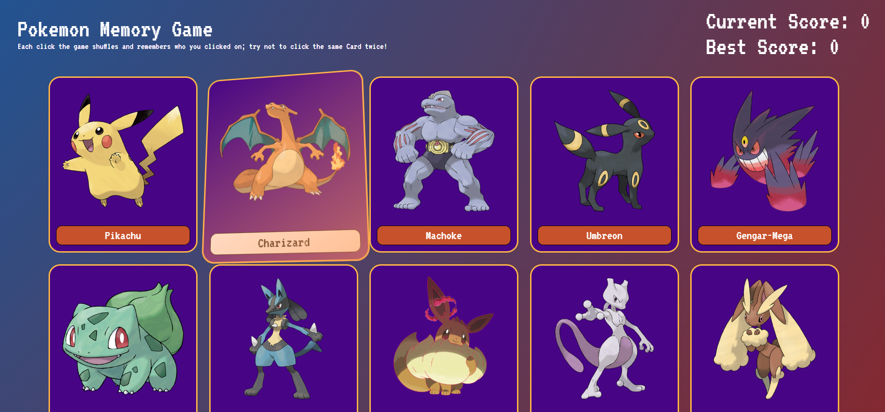

# 🧠 Memory Card Game

A fast, interactive **memory game** built with **React** and **Vite**, focused on clean state management, performance, and user experience.

🔗 **Live Demo:** https://memory-card-gametc.netlify.app/  

---

## 📌 Overview

This project demonstrates practical frontend skills including **React hooks**, **state-driven UI**, and **deterministic game logic**.  
Users must select each card only once — repeated selections reset the score, encouraging attention and memory.

---

## ✨ Key Highlights

- ⚛️ Modern **React** with functional components and hooks
- ⚡ **Vite** for fast builds and optimized dev experience
- 🔀 Card shuffling logic after each interaction
- 📊 Current score & best score tracking
- 📱 Responsive UI
- 🚀 Deployed with **Netlify**

---

## 🛠️ Tech Stack

- **React**
- **Vite**
- **JavaScript (ES6+)**
- **CSS**
- **Netlify**

---

## 🧠 What This Project Shows

- Correct usage of **React state & effects**
- Immutable data handling
- Clean component structure
- UI updates driven entirely by state
- Basic game logic and edge-case handling
- Production-ready deployment workflow

---

## 🖼️ Screenshots

> Screenshots can be added in a `/screenshots` folder.



---

## 🚀 Installation & Local Setup

```bash
git clone https://github.com/cebotaritigran/memory-card.git
cd memory-card
npm install
npm run dev